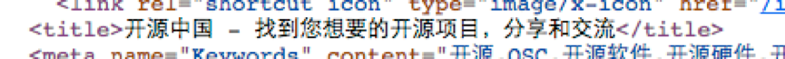

> 也许你想搜索一个东西，只会把关键字输进去，有时得到很多你并不需要的。导致你寻找一篇你要的就很难，我这里简单介绍一点搜索的方法。加快你搜索东西的效率，毕竟时间就是金钱。

- 常用筛选工具：

  - intitle:keyword  e.g intitle:"开源中国"
  
  	
  	
  	
  	
  	看到这个title，如果想查找这个
  - inurl:keyword
  - filetype:   //文件类型  filetype:pdf java
  - size:keyword    site:oschina.net title:python

- 常用服务工具

 - 日常生活
   - 天气/时间：weather/time/sunrise/sundown 城市名
   - 汇率:货币 in 货币2
   - 倒数计时器：set timer 数字 seconds/minutes/hours
   - 行程/航班:城市一 to 城市二    + train
   - 自己的ip: what's my ip

  - 学术应用
   - 计时器:eg：2016+2016^2
   - 化学物质:eg:H2CO3
   - GDP/GNP查询:国名 gdp/gnp
   - 回执函数图像: graph for 函数式
